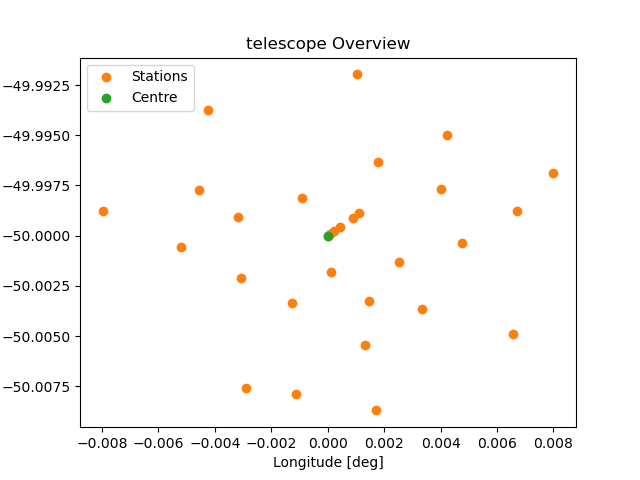

# Examples

## Running an interferometer simulation

Running an interferometer simulation is really easy.
Please look at the karabo.package documentation for specifics on the individual functions.

```python
<example_interfe_simu.py>
```

## Show telescope config

```python
<example_tel_set.py>
```



## Use Karabo on a SLURM cluster

Karabo manages all available nodes through Dask, making the computational power conveniently accessible for the user. The `DaskHandler` class streamlines the creation of a Dask client and offers a user-friendly interface for interaction. This class contains static variables, which when altered, modify the behavior of the Dask client. 

While users are not required to interact with Dask directly - thanks to the background processes managed by Karabo - the Dask client can be used directly if necessary. This method is recommended when there is a need to prevent your Python script from being processed on multiple nodes.

Protecting the `Nanny` process by the `if __name__ == "__main__":` statement is essential since the nodes cannot be assigned as a `Dask Worker/Nanny` outside of this statement. 

When the client isn't called at the start of the script, either by using the client or calling `DaskHandler.setup()`, the script runs on every node until `Karabo` initializes the Dask client, even on different nodes. 

It's important to remember that this approach is intended to streamline your work. However, if issues or additional requirements arise, one can always interact with the Dask client directly.

```python
from karabo.util.dask import DaskHandler

if __name__ == "__main__":
    # Get the Dask client
    client = DaskHandler.get_dask_client()

    # Use the client as needed
    result = client.submit(my_function, *args)
```
```python
from karabo.util.dask import DaskHandler

if __name__ == "__main__":
    DaskHandler.setup()
    ...
```

Disable the usage of Dask by Karabo.

```python
from karabo.util.dask import DaskHandler
# Modify the static variables
DaskHandler.use_dask = False
```

Please also check out the `DaskHandler` under `karabo.util.dask` for more information.

### Dask Dashboard
The link for the Dask Dashboard is written into a .txt file called `karabo-dask-dashboard.txt`. This file is located in the same directory as where the run was started. This URL can then be pasted into a browser to access the Dask Dashboard. If you run Karabo on a VM without access to a browser and internet, you can use `port forwarding` to access the Dask Dashboard from your local machine. In `VSCODE`, this can be done directly when using the "PORTS" tab; just paste the IP address and port number from the .txt file into the Port column and click on "Open in Browser" in the Local Adress column.